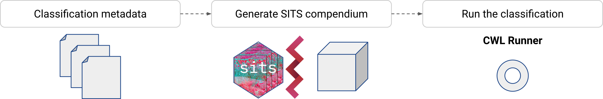

..
    Copyright (C) 2021 SITS Common Workflow Language tool.

    sitscwl is free software; you can redistribute it and/or modify
    it under the terms of the MIT License; see LICENSE file for more details.

.. raw:: html

   

======================================================
 sitscwl - SITS R Package with CWL batteries included
======================================================

.. image:: https://img.shields.io/badge/license-MIT-green
        :target: https://github.com/sitscwl/sitscwl/blob/master/LICENSE
        :alt: Software License

.. image:: https://img.shields.io/badge/code%20style-black-000000.svg
        :target: https://github.com/psf/black

.. image:: https://img.shields.io/badge/lifecycle-maturing-blue.svg
        :target: https://www.tidyverse.org/lifecycle/#maturing
        :alt: Software Life Cycle

.. image:: https://img.shields.io/pypi/dm/sitscwl.svg
        :target: https://pypi.python.org/pypi/sitscwl

.. image:: https://img.shields.io/github/tag/sitscwl/sitscwl.svg
        :target: https://github.com/sitscwl/sitscwl/releases

Overview
========

The ``sitscwl`` is a Python library created to facilitate the production of reproducible Common Workflow Language (CWL) workflows for generating Land Use and Land Cover maps made with the R SITS package.

The CWL workflow generation approach adopted by ``sitscwl`` assumes three simple steps:

1. **Classification description**: In this step, the user describes the classification that must be performed with the SITS package. In this description, the specification is made: (i) Data source; (ii) Machine Learning Algorithm; (iii) Spatiotemporal extension; (iv) Samples used to train the Machine Learning algorithm;
2. **Generate the SITS Compendium**: Based in the classification metadata, defined in the previsous step, a classification research compendium is generated. In this compendium, all elements required for the classification is organized in a clear and reproducible way;
3. **Run the classification**: With the Compendium generated, the user can use the CWL description to execute the classification.

.. note::

    **Recomendation**: The classification methodology used in the ``sitscwl`` is based on the `SITS R Package <https://github.com/e-sensing/sits>`_, so its recommended, before use the `sitscwl`, learn more about the SITS R Package itself. For more information about the SITS classification methodology, please refer to `Simoes et al (2021) <https://doi.org/10.3390/rs13132428>`_.

The conceptual view of the ``sitscwl`` workflow is presented in the figure below:

Obtaining sitscwl
------------------

``sitscwl`` is currently available on github. You can install it using the following command in your shell::

    pip install git+https://github.com/sitscwl/sitscwl

or ::

    poetry add git+https://github.com/sitscwl/sitscwl

Using sitscwl
--------------

To use the ``sitscwl``, first, you need to create a Python script. In this script, you will use the ``sitscwl`` API to create a SITS-based CWL classification compendium. Below, a step-by-step guide is presented in how to use the ``sitscwl`` API:

1. Importing the ``sitscwl``

.. code-block:: python
   :linenos:

   # Random Forest model API.
   from sitscwl.models import RandomForest

   # SITS Cube API.
   from sitscwl.models import SITSCube

   # Classification compendium auxiliary function.
   from sitscwl.compendium import make_classification_compendium

2. Defining the data cube

.. code-block:: python
   :linenos:

   # Defining the data cube object
   sits_cube = SITSCube(
      collection="CB4_64_16D_STK-1",
      start_date="2018-08-29",
      end_date="2019-08-29",
      bands=["BAND13", "BAND14", "BAND15", "BAND16", "EVI", "NDVI", "CMASK"],
      tiles=["022024"],
   )

3. Defining the Machine Learning Model

.. code-block:: python
   :linenos:

   ml_model = RandomForest(num_trees=1000)

4. Creating the SITS-based Classification compendium

.. code-block:: python
   :linenos:

   # Computational Resources
   memsize = 16 # GB
   cpusize = 8

   # Data Resources
   compendium_dir = ""  # Where the generated compendium will be saved
   samples = ""  # Samples used to train the ML Model

   # Service Resources
   bdc_access_token = "" (Brazil Data Cube Access Token)

   # Creating the classification compendium.
   make_classification_compendium(
      basedir=compendium_dir,
      cube=sits_cube,
      ml_model=ml_model,
      sample_file=samples,
      memsize=memsize,
      cpusize=cpusize,
      bdc_access_token=bdc_access_token,
   )

> If needed, you can create a ``Brazil Data Cube Access Token``, please check this `<tutorial https://brazil-data-cube.github.io/applications/dc_explorer/token-module.html>`_.
   
More examples ? Check the ``examples`` directory.
